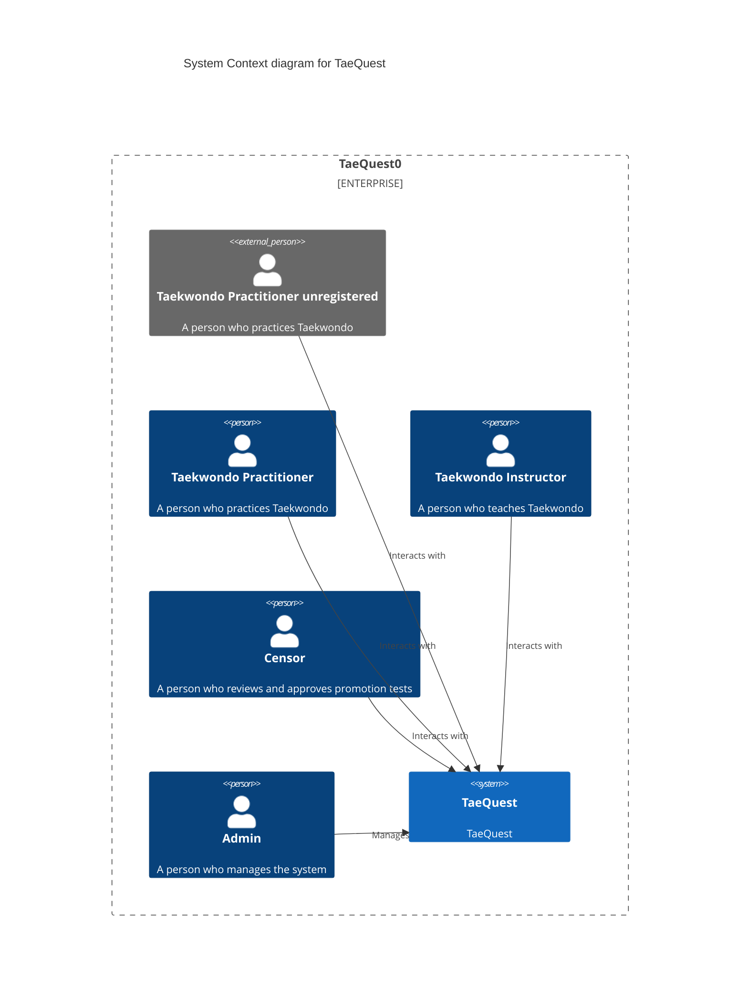
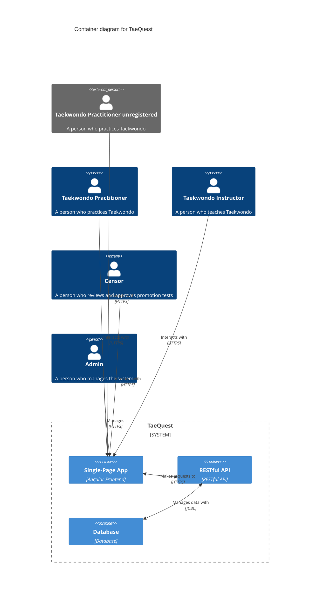
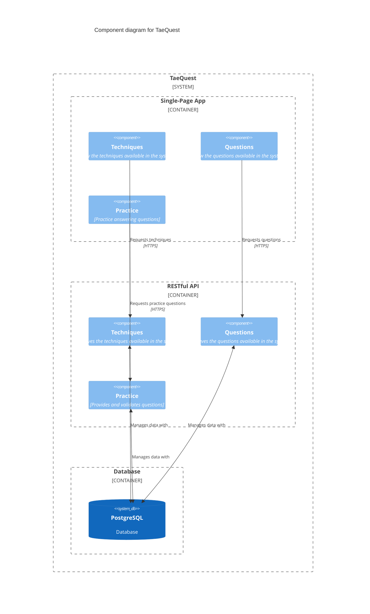

# Architecture

## Overview

TaeQuest is a system that allows Taekwondo practitioners improve their skills within Taekwondo and instructors to manage their students and Censors to review and approve promotion tests.
The system is composed of a Single-Page App (SPA) frontend, a RESTful API backend, and a database.

## Context diagram

The context diagram shows the system boundary and the actors that interact with the system.

# Container diagram

The container diagram shows the containers that make up the system and the actors that interact with them.

# Component diagram

The component diagram shows the components that make up the system and the interactions between them.

For starters we are focusing on the user journey of a common user who wants to learn more about Taekwondo. The user can view the techniques available in the system, view the questions available in the system, and practice answering questions.

