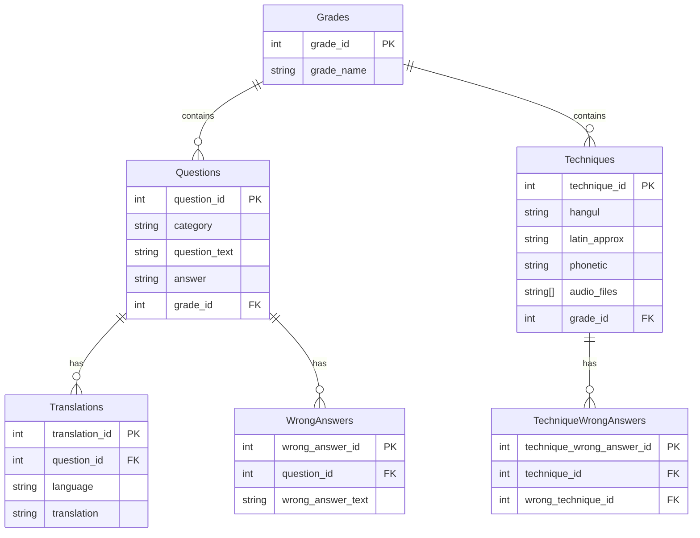

# Database

## Database schema

> NOTE: Initial thoughts on the database schema

Tables

1. **Grades**
   - `grade_id` (Primary Key, Integer)
   - `grade_name` (Text) - e.g., "10th Kup", "9th Kup", "1st Dan"

2. **Questions**
   - `question_id` (Primary Key, Integer)
   - `category` (Text) - e.g., "Technique", "Form", "Vocabulary"
   - `question_text` (Text) - The actual question (e.g., "How many counts are there in Taegeuk Il-jang?")
   - `answer` (Text) - The correct answer for non-translation items (e.g., "19")
   - `grade_id` (Foreign Key to Grades, Integer, Nullable) - Optional association with a grade

3. **Techniques**
   - `technique_id` (Primary Key, Integer)
   - `hangul` (Text) - Korean representation of the technique
   - `latin_approx` (Text) - Approximation in Latin characters
   - `phonetic` (Text) - IPA phonetic transcription
   - `audio_files` (Text Array) - List of audio files for pronunciation
   - `grade_id` (Foreign Key to Grades, Integer) - Associated grade for the technique

4. **Translations**
   - `translation_id` (Primary Key, Integer)
   - `question_id` (Foreign Key to Questions, Integer)
   - `language` (Text) - e.g., "English", "Spanish"
   - `translation` (Text) - Translated text for questions

5. **WrongAnswers**
   - `wrong_answer_id` (Primary Key, Integer)
   - `question_id` (Foreign Key to Questions, Integer)
   - `wrong_answer_text` (Text) - Potential wrong answer text for questions

6. **TechniqueWrongAnswers**
   - `technique_wrong_answer_id` (Primary Key, Integer)
   - `technique_id` (Foreign Key to Techniques, Integer)
   - `wrong_technique_id` (Foreign Key to Techniques, Integer) - ID of another technique as a possible wrong answer

```sql
-- Create Grades Table
CREATE TABLE Grades (
    grade_id SERIAL PRIMARY KEY,
    grade_name TEXT NOT NULL
);

-- Create Questions Table
CREATE TABLE Questions (
    question_id SERIAL PRIMARY KEY,
    category TEXT NOT NULL,
    question_text TEXT,
    answer TEXT,
    grade_id INTEGER REFERENCES Grades(grade_id)
);

-- Create Techniques Table
CREATE TABLE Techniques (
    technique_id SERIAL PRIMARY KEY,
    hangul TEXT NOT NULL,
    latin_approx TEXT NOT NULL,
    phonetic TEXT NOT NULL,
    audio_files TEXT[],
    grade_id INTEGER REFERENCES Grades(grade_id)
);

-- Create Translations Table
CREATE TABLE Translations (
    translation_id SERIAL PRIMARY KEY,
    question_id INTEGER REFERENCES Questions(question_id),
    language TEXT NOT NULL,
    translation TEXT NOT NULL
);

-- Create WrongAnswers Table
CREATE TABLE WrongAnswers (
    wrong_answer_id SERIAL PRIMARY KEY,
    question_id INTEGER REFERENCES Questions(question_id),
    wrong_answer_text TEXT NOT NULL
);

-- Create TechniqueWrongAnswers Table
CREATE TABLE TechniqueWrongAnswers (
    technique_wrong_answer_id SERIAL PRIMARY KEY,
    technique_id INTEGER REFERENCES Techniques(technique_id),
    wrong_technique_id INTEGER REFERENCES Techniques(technique_id)
);
```

## Entity-relationship-diagram
